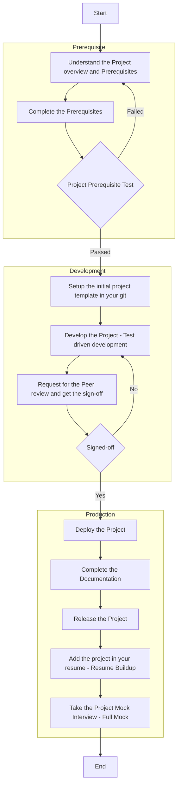

# Bootcamp Instructions

## Assignments

- In assignments, you’re given a scenario and a set of tasks. Instead of following step-by-step instructions, you will use the skills learned from the classes to figure out how to complete the tasks on your own!
- When you take an assignment, you will not be taught new concepts. You are expected to extend your learned skills, like changing default values and reading and researching error messages to fix your own mistakes.
- To score 100% you must successfully complete all tasks within the time period!

## Project Process

## Techstack

