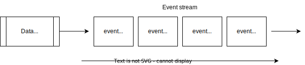

# Real-Time Analytics

## What is an event stream?

The term “streaming” describes a continuous, never-ending flow of data with no beginning or end. The data is made available incrementally over time, which means that you can act upon it without needing to wait for the whole dataset to become available so that you can download it.

A data stream consists of a series of data points ordered in time i.e. chronological order, as shown:

Each data point represents an “event” or a change in the state of the business. For example, real-time events like a stream of transactions coming from an organisation or IoT sensors emitting their readings. One thing in common is that they keep on producing data for as long as the business exists.

Events streams are generated by different data sources in a business, in various formats and volumes.

We can also consider a data stream as an immutable, time-ordered stream of events, carrying facts about state changes that occurred in the business.

These sources include but are not limited to ecommerce purchases, in-game player activity, information from social networks, clickstream data, activity logs from web servers, sensor data, and telemetry from connected devices or instrumentation in data centers.

An example of an event would be the following:

> A user with ID 1234 purchased item 567 for $3.99 on 2022/06/12 at 12:23:212

Events have a shelf life. The business value of events rapidly decreases over time. The sooner you understand events’ behaviour, the sooner you can react and maximize your business outcome.

For example, if we have an event that a user abandoned their shopping cart, we can reach out to them via SMS or email to find out why that happened. Perhaps we can offer them a voucher for one the items in their cart to entice them to come back and complete the transaction.

But that only works if we’re able to react to the cart abandonment in real-time. If we detect it tomorrow, the user has probably forgotten what they were doing and will likely ignore our email.

## Real-time analytics

Real-time analytics systems capture, analyze and act upon events as soon as they become available. They are the unbounded, incrementally processed counterpart to the batch processing systems that have dominated the data analytics space for many years.

## Use Cases

### User Facing Analytics

Organizations have been generating and collecting massive amounts of data for a long time now. Analytics on that data has been playing a crucial role in analyzing user behavior, growth potential, and revenue spend, enabling employees and executives to make key business decisions.

This analytics has mostly been done inside an organization, but there is an increasing desire to provide this analytical capability directly to end users. Doing so will democratize decision making and provide an even more personalized experience. The term _User-Facing Analytics_ has been coined to describe this process.

The key requirements are high throughput and low query latency since this directly impacts the user experience.

### Personalization

This is a special type of user-facing analytics where we personalize the product experience for a given user. This might mean showing them content that they’ll be particularly interested in or presenting them with vouchers unique to their interests.

It is done by going through user’s activity and product interaction and extracting real-time features, which are then used to generate personalized recommendations or actions.

### Metrics

Tracking business metrics in real-time allows us to get an up to date view on KPIs. This enables organizations to identify issues and take proactive steps to address them in a timely manner.

Being able to do this is particularly critical for operational intelligence, anomaly/fraud detection, and financial planning.

This use case has a requirement for a high number of queries per second along with low latency. We must also achieve a high degree of data accuracy.

### Anomaly Detection and Root Cause Analysis

Anomaly Detection and Root Causes Analysis is a popular use case when working with time series data. Time series data is a sequence of data points collected over a period of time.

In the context of e-commerce, this could include data like the number of transactions per day, average transaction value, or number of returns.

Anomaly detection is all about identifying unusual patterns in data that may indicate a problem that we need to address. That problem might be a sudden surge in orders of a particular product or even that fraudulent activity is being committed.

Either way, we need to find out what went wrong quickly - it’s no use finding out that we had a problem 24 hours ago, we need to know about it now!

And once we’ve detected that something unusual has happened, we also need to understand which dimensions were responsible for any anomalies. In other words, we need to find the root cause of the issue.

Both of these use cases perform temporal scans and _group by_ queries at a high number of queries per second.

### Visualization

Much has been said about the death of the dashboard, but they still have a role to play in the real-time analytics space.

This could be as simple as a dashboard that plots metrics on different charts or as complex as geospatial visualization, clustering, trend analysis, and more. The main difference to a typical dashboard is that tables and charts will be constantly updated as new data comes in.

The serving layer must integrate with existing visualization solutions like Apache Superset and Grafana.

### Ad Hoc Analytics

Analysts often want to do real-time data exploration to debug issues and detect patterns as events are being ingested. This means that we should be able to run SQL queries against the serving layer.

Analysts will also want to do some analysis that combines real-time data with historical data. For example, they might want to see how the business is performing this month compared to the same month in previous years. This means that we either need to bring the historical data into the serving layer or use a distributed SQL query engine that can combine multiple data sources.

The number of queries per second will be slow, but query complexity is likely to be high.

### Log Analytics / Text Search

Running real-time text search queries on application log data is a less common, but still important use case. Since logs are often unstructured, we must be able to run regex style text search on this data to triage production issues.

The queries per second will be low for most applications, but will get higher if we are debugging a user-facint application.

## Real-Time flow

*Figure below* is a typical real-time data flow that captures data from a source, transforms it, and serves it using a real-time OLAP database. The diagram is completed with a real-time visualization to an end user.

**Real-time transformation** engines are distributed, stateful ***stream processors*** that can perform complex transformations on real-time data. They can handle high throughput data at any scale. The role of the stream processor is to preprocess the data before it reaches the real-time OLAP database.

**Real-time OLAP (RTOLAP)** are databases that can serve data with high query per second (QPS). QPS is a good indicator of good end user experience. End users could be actual users or other applications. The higher the QPS, the better the experience for end users. The stream processors take away the need for these databases to preprocess the data so that they can focus their resources on higher QPS.

## Processing Streaming data

In the big data era, people like to correlate big data with real-time data. Some people say that if the data is not real-time, then it's not big data. This statement is partially true. In practice, the majority of data pipelines in the world use the batch approach, and that's why it's still very important for data engineers to understand the batch data pipeline.

However, real-time capabilities in the big data era are something that many data engineers need to start to rethink in terms of data architecture. To understand more about architecture, we first need to have a clear definition of what real-time data is.

From the end-user perspective, real-time data can mean anything---anything from faster access to data, more frequent data refreshes, and detecting events as soon as they happen. From a data engineer perspective, what we need to know is *how* to make it happen. For example, if you search any keyword in Google Search, you will get an immediate result in real time. Or, in another example, if you open any social media page, you can find your account statistics and the number of friends, visitors, and other information in real time. 

But if you think about it, you may notice that there is nothing new in both of the examples. As an end user, you can get fast access to the data because of the backend database, and this is a common practice dating from the 1990s. In big data, what's new is the real time in terms of incoming data and processing. This specific real-time aspect is called **streaming data**. For example, you need to detect fraud as soon as an event happens. In most cases, detecting fraud needs many parameters from multiple data sources, which are impossible to be handled in the application database. If fraud has no relevance to your company, you can think of other use cases such as real-time marketing campaigns and real-time dashboards for sales reporting. Both use cases may require a large volume of data from multiple data sources. In these kinds of cases, being able to handle data in streams may come in handy.

### Streaming data for data engineers

Streaming data in data engineering means a data pipeline that flows data from the upstream to the downstream as soon as the data is created. In nature, all data is created in real time, so processing data in batches is a way to simplify the process.

What does this mean?

If you think about how every piece of data is created, it's always in real time---for example, a user registered to a mobile application. The moment the user registered, data was created in the database. Another example is of data being input into a spreadsheet. The moment the data entry is written in the spreadsheet, data is created in the sheet. Looking at the examples, you can see that data always has a value and the time when it's created. Processing streaming data means we process the data as soon as the data is inputted into a system. 

Take a look at the following diagram. Here, there are two databases: the source database and the target database. For streaming data, every time a new record is inserted into the source database (illustrated as boxes with numbers), the record is immediately processed as an event and inserted into the target database. These events happen continuously, which makes the data in the target database real-time compared to the source database:

In data engineering, the antonym for *stream* is *batch*. Batching is a very common approach for data engineers to process data. Even though we know data is real-time in nature, it's a lot easier to process data in a set time. For example, if your **chief executive officer** (**CEO**) wants to know about the company's revenue, it's a lot easier to populate the purchase history in a month and calculate the revenue, rather than build a system then continuously calculate the purchase transactions. Or, in a more granular level, a batch is commonly done on a weekly, daily, or hourly basis. The batch approach is a widely used practice in the data engineering world; I can say 90% of the data pipeline is a batch. 

Take a look at the following diagram. Here, the two databases are the same as the above figure. The nature of how data is inserted into the source database is also the same---it's always real-time from the source database perspective. The difference is in the processing step, where the records are grouped into batches. Every batch is scheduled individually to be loaded to the target database:

There are two major reasons why processing data in batches is more popular compared to streams. The first is because of the data user's needs. The data user, who is usually called a decision maker, naturally asks for information over a period of time. As we've discussed in the previous example, common questions are *How much X in a day?* or *How many X in a month?*. It's very rare to have a question such as *How much X occurred this second compared to the last second?*.

The second reason is the complexity of technology. Batching is easier than streaming because you can control a lot of things in a batch---for example, you can control how you want to schedule data pipeline jobs. This doesn't apply to stream processing. A streaming process is one job; once it runs, it will process all the incoming data and it never ends. To handle all the complexities, we need specific sets of technologies.

## Real-Time Analytics Applications

Real-time analytics applications combine characteristics from both traditional reporting analytics and transactional applications.

Streaming data is data that is generated continuously by thousands of data sources, which typically send in the data records simultaneously, and in small sizes (order of Kilobytes). Streaming data includes a wide variety of data such as log files generated by customers using your mobile or web applications, ecommerce purchases, in-game player activity, information from social networks, financial trading floors, or geospatial services, and telemetry from connected devices or instrumentation in data centers.

Analyzing and measuring data as soon as it enters the database is referred to as real-time analytics. Thus, users gain insights or may conclude as soon as data enters their system. Businesses can react quickly using real-time analytics. They can grasp opportunities and avert issues before they occur. On the other hand, Batch-style analytics might take hours or even days to provide findings. As a result, batch analytical systems frequently produce only static insights based on lagging indications. Real-time analytics insights may help organizations stay ahead of the competition. These pipelines for streaming data generally follow a 3 step process, i.e., Ingest, Analyze and Deliver.

Data from various sources, including applications, devices, sensors, clickstreams, and social media feeds, can be analyzed to find patterns and linkages. These patterns can be used to start workflows and trigger events like alert creation, information feeding into reporting tools, or storing altered data for future use.

This data needs to be processed sequentially and incrementally on a record-by-record basis or over sliding time windows, and used for a wide variety of analytics including correlations, aggregations, filtering, and sampling. Information derived from such analysis gives companies visibility into many aspects of their business and customer activity such as –service usage (for metering/billing), server activity, website clicks, and geo-location of devices, people, and physical goods –and enables them to respond promptly to emerging situations. For example, businesses can track changes in public sentiment on their brands and products by continuously analyzing social media streams, and respond in a timely fashion as the necessity arises.

There are four key requirements for supporting real-time analytics. They are latency, freshness, throughput, and concurrency, as seen below:

These four ideas work together to control business’s ability to make decisions on the fly. They are required to ensure that data transforms into actionable analytics as close to real-time as possible (in fractions of a second). They are also necessary to quickly tie current transactions with historical data for comparisons and trends without having to preprocess the data.

AWS has a very robust stack of technologies such as Kinesis Data Streams, Kinesis Data Firehose, Kinesis Data Analytics, and Managed Streaming for Kafka when it comes to working with streaming data.

### Examples of Real-Time Analytics Applications

#### Netflix

To ensure a consistently great experience to more than 100 million members in more than 190 countries enjoying 125 million hours **of TV shows** and movies each day, Netflix built a real-time analytics application for user experience monitoring. By turning log streams into real-time metrics, Netflix can see how over 300 million devices are performing at all times in the field. Ingesting over 2 million events per second and querying over 1.5 trillion rows, Netflix engineers can pinpoint anomalies within their infrastructure, endpoint activity, and content flow.

An ongoing challenge for Netflix is consistently delivering a great streaming entertainment experience while continuously pushing innovative technology updates. As Netflix’s adoption has skyrocketed, this challenge has grown more complex. With over 300 million devices spanning four major UIs including iOS, Android, smart TVs, and their own website, Netflix has a constant need to identify and isolate issues that may affect only a certain group, such as a version of the app, certain types of devices, or particular countries. Ben Sykes, software engineer at Netflix, says that “with this data arriving at over 2 million events per second, getting it into a database that can be queried quickly is formidable. We need sufficient dimensionality for the data to be useful in isolating issues and as such we generate over 115 billion rows per day.”

To quantify how seamlessly users’ devices are handling browsing and playback, Netflix derives measurements using real-time logs from playback devices as a source of events.

Netflix collects these measures and feeds them into the real-time analytics database. Every measure is tagged with anonymized details about the kind of device being used—for example, whether the device is a smart TV, an iPad, or an Android phone. This enables Netflix to classify devices and view the data according to various aspects. This aggregated data is available immediately for querying, either via dashboards or ad hoc queries. “We’re currently ingesting at over 2 million events per second,” Sykes says, “and querying over 1.5 trillion rows to get detailed insights into how our users are **experiencing** the service. All this helps us maintain a high-quality Netflix experience, while enabling constant innovation.”

The ultimate benefit is speed, which is essential for a service that needs to react to a massive number of users in near real time.

#### Walmart

To compete with Amazon and other retailers, Walmart needs to track the pricing of their competitors in real time and allow analysts to explore the gathered data interactively.

Many data sets at Walmart are generated by the digital business, modeled as streams of events ranging from server logs to application metrics to product purchases. The goal of the team at Walmart Labs is to make it easy for the right people across Walmart to access this data, analyze it, and make decisions in the least amount of time **possible.**

Walmart’s first attempt to provide low-latency analytics was to leverage the Hadoop ecosystem. It tried using Apache Hive first and then Presto. According to Amaresh Nayak, distinguished SW engineer at Walmart Labs, “The problem we faced with both of these SQL-on-Hadoop solutions was that queries would sometimes take hours to complete, which significantly impacted our ability to make rapid decisions. Although our data was arriving in real time, our queries quickly became a bottleneck in our decision-making cycle as our data volumes grew. We quickly realized that the workflow we were aiming to optimize was one where we could look at our event streams (both real-time and historical events) and slice and dice the data to look at specific subsections, determine trends, find root causes, and take actions accordingly.”

The team at Walmart knew it needed to make a change. The types of queries the team runs require column aggregation, which involves scanning a lot of rows across multiple shards. Walmart found that relational databases were poorly suited for this because they cannot efficiently enable data exploration in real time. The team also ruled out a NoSQL key-value database because of the need to query multiple partitions across a number of nodes. Using this database would have caused inefficient aggregation calculations and exponentially increased storage requirements by storing aggregates for all possible column combinations.

Using a real-time analytics application, Walmart can now pre-aggregate records as they are being ingested. Instead of getting a single price for an item for a specific moment in time, Walmart can now understand the changing price of an item over any span of time. This combined level of depth and speed to insights is essential to enabling Walmart to make critical pricing decisions in the least amount of time possible. “After we switched [to real-time analytics],” Nayak says, “our query latencies also dropped to near sub-second and in general, the project fulfilled most of our requirements. Today, our cluster ingests nearly 1B+ events per day (2TB of raw data).”

## Streaming in Google Cloud

Watch this video: https://www.youtube.com/watch?v=3Y7PhzFbz_s

## Streaming data challenges

Watch this video: https://www.youtube.com/watch?v=0vbdoFNCUOA

## Streaming Database

**Streaming databases** try to do *both - Stream processing and Real-time OLAP.* They have stream processing capabilities as well as the ability to serve real-time data with high QPS like a RTOLAP.

Streaming database cannot be created by simply putting a SQL based stream processor and a RTOLAP together. ***They need to share the same SQL processor/engine for both transforming data and serving data.*** It provides a ***single SQL interface*** for user facing applications that *pull* data from a RTOLAP with high QPS and for developers building transformations that *push* data downstream in a data pipeline.

## Comparison

