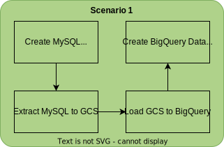

# Building a BigQuery Data Warehouse

## Introduction

We will proceed with the help of two scenarios. Each scenario will have different learning purposes.

In the first scenario, we are going to focus on how to use the tools. After understanding the tools, in the second scenario, we will focus on the principles. Principles here mean that even though we know how to use the tools, there are many possibilities for using them. If we are talking about principles, there is no right or wrong answer. What we can do is to learn from common patterns and a number of theories. 

In each scenario, the starting point is *requirements* and *business questions*. In the real-world scenario, it's the same. You will satisfy end user requirements and business questions, and these two aspects are the ingredients for designing and building a data warehouse.

The second step is the *thinking process*. After reading the requirements and business questions, I suggest you think for yourself first in terms of how you want to do it. However, I will also share my thoughts on the steps and planning, so you can compare them with yours. After that, we will build the *solutions* in BigQuery.

## Data

We will use the San Francisco bike-sharing dataset. The dataset relates to a bike-sharing company. The company records the trip data of its members. Each bike trip contains information about the stations, and lastly, each station is located in certain regions. This dataset is very simple compared to a real-world data warehouse, but for practice purposes, this is a good representation of real database tables from application databases.

## Upload the data

### Upload a local file to the GCS bucket using gsutil

```bash
export DESTINATION_BUCKET_NAME=sparsh-data-eng-on-gcp-data-bucket
gsutil cp -r data/* gs://$DESTINATION_BUCKET_NAME/
```

## Scenario 1

[source code](./01-scenario-1.ipynb)

### Requirements

In this scenario 1, we met with business users, and here are their requirements:

1. As a regional manager user, I want to know the top two region IDs, ordered by the total capacity of the stations in that region.
2. As a regional manager, I want to download the answers to my questions as CSV files to my local computer.
3. The data source table is the station table, which is located in the **CloudSQL-MySQL** database.
4. There will be more data sources in the future besides the station table.

Given the requirements, I suggest you take a moment to imagine yourself in this situation: 

- What will you do?
- What GCP services will you use?

### Steps and planning

Given the first and second statements, we understand that the business user wants to be able to download the results as a CSV file from a very specific business question. 

1. Since there is a very specific business rule, we need some transformation. The rule seems doable in SQL, and BigQuery is a good system for handling such jobs.
2. The BigQuery table can easily be downloaded into CSV files from the console. So, storing the results as a BigQuery table or view will be great.

From the second and third requirements, we learned that the source data is in a MySQL database and may potentially come from another database in the future.

Since the data sources come from multiple systems, this is a data warehouse situation.

The data is in the **CloudSQL-MySQL** database, so we need to find a way to extract the **station** table from the MySQL database and load it into BigQuery.

There are options for doing the extract and load from MySQL to BigQuery. For standardization and scalability, we will use GCS as our staging layer from MySQL. This extraction method applies to almost any data source. On top of that, GCS is also very scalable when it comes to handling the incoming data in terms of volume, variety, and velocity.

Loading data from GCS to BigQuery is very straightforward, and we can use the BigQuery console for this.

So, here are the overall steps:



Note that in this practice, we don't want to learn about MySQL databases in depth, but we will still try to create a CloudSQL instance for MySQL. The goal is for us to really try to understand what *Extract* in *ETL* really means, and how to do it.

#### Step 1: Create a MySQL database in CloudSQL

The first step is to prepare our CloudSQL-MySQL environment. This step is not part of building a data warehouse. However, to simulate table extraction from application databases to GCS, this will be very helpful. So, let's start by creating the Cloud SQL instance. Here are the steps:

1. Create a CloudSQL instance.
2. Connect to the MySQL instance.
3. Create a MySQL database.
4. Create a table in the MySQL database.
5. Import CSV data into the MySQL database.

#### Step 2: Extract data from MySQL to GCS

In *step 2*, we want to extract data from the MySQL database to GCS.

Since we are using CloudSQL, we can use the **gcloud** command to dump tables into GCS files, but you can do the same thing in self-managed MySQL without using the **gcloud** command.

First of all, we need to handle **Identity and Access Management (IAM**). We need to assign the **CloudSQL service account** a **Storage Object admin** role first. You can find the service account in your CloudSQL console. The service account will be in this format: `**[any text]@gcp-sa-cloud-sql.iam.gserviceaccount.com**.` Copy that service account to any text editor because we want to add an IAM role to it.

To add the new role to the service account, follow these steps:

1. Go to the navigation bar.
2. Choose **IAM & Admin** -> **IAM**.
3. Click **+Add**. 
4. Paste the CloudSQL service account into **New principals**.
5. Then, select a role.

Type **gcs object** and you will be able to choose **Storage Object Admin** (not **Storage Admin**).

After finishing the process, your CloudSQL service account will have permission to write and delete file objects in all GCS buckets in your project.

To summarize, the preceding steps are necessary to grant the CloudSQL service account the **Storage Object Admin** role. The role is to allow the service account to load data to your GCS bucket. Next, we want to load the data.

Access your Cloud Shell again and trigger a **gcloud** command to export the MySQL query results to a CSV file using the shell script already available in the associated jupyter notebook.

For each export command, wait around 5 minutes for completion. 

Once finished, you can check in your GCS bucket under the **mysql_export** folder. Your station CSV file should be there. If not, recheck every step.

In a real-world scenario, most of the time, the extractions happen from the clone instance. Application databases usually have a clone instance for providing high availability. Hence, it's good to extract data from there. That way, we won't interrupt the production database.

Summarizing this step regarding moving data fromCloudSQL to GCS, it is designed to demonstrate the *E* in *ETL*, which is to extract data from a data source into a GCS bucket. The method is pretty much the same for other database types, but every database might have a different command for dumping (exporting) table data to files. 

For the exercises throughout this lab, we will assume that the data is already in the GCS bucket. You can delete the MySQL instance for now.

Check the CloudSQL home page to ensure that the instance is deleted.

#### Step 3: Load GCS to BigQuery

In *step 3*, we will load data from GCS to BigQuery using the BigQuery console.

Let's go to the BigQuery console and create a new dataset named **raw_bikesharing**.

Just as a reminder, for this exercise, let's use the default (multi-region US) dataset location. In scenario 2 later, we will want to use some tables from public datasets, which are located in the US.

In the **raw_bikesharing** dataset, let's create a new table from the BigQuery console:

1. Click on the Create table icon (**+**).
2. In the **Create table from** option, choose **Google Cloud Storage.** Browse Select file from GCS bucket: `[your bucket name]/mysql_export/stations/20180101/stations.csv`
3. For **Table name**, select **stations**. Note that the BigQuery table name is case-sensitive. We use lowercase letters in this instance.
4. In the **Schema** option, choose **Edit as text**.
5. Write the following in the **schema** textbox: `station_id:STRING,name:STRING,region_id:STRING,capacity:INTEGER`
6. Click on **Create table**.

   IMPORTANT NOTE

   > There is another alternative for defining the schema. You can try to enter your field names yourself. However, don't use the autodetect schema since the CSV file exported from MySQL doesn't provide headers.
   >

You can check the **stations** table and see that the data is already in the BigQuery table. We have four columns here: **station_id**, **name**, **region_id**, and **capacity**.

If you can see the preceding table, we are good to go regarding the final step of this scenario.

#### Step 4: Create a BigQuery data mart

Depending on company regulations, most companies don't allow business users to access raw tables directly. Business users usually access data from data marts. 

Technically, you can use BigQuery or other databases as the data mart. In this example, we will use BigQuery as our data mart, which is a very common practice. 

Let's create a new dataset with the name **dm_regional_manager**.

Now, at this point, let's revisit what the business question is.

*As a business user, I want to know the top two region IDs, ordered by the total stations' capacity in that region*.

As the final step, we want to create a table or view in our BigQuery data mart based on the query result.

Now we have two options for the query results:

- Create a table.
- Create a view.

Both tables and views have advantages and disadvantages. There are two advantages to using a view. First, the view costs no additional storage. If you create a view, the data won't be stored anywhere; it will just save the SQL formula. The second advantage is real time; if you access the view, then every time the underlying table changes, the view will get the latest update.

However, there are reasons as to why you would want to avoid using too many views physicalized into a new table. Sometimes, views can be heavy, and when the underlying tables are large and there are many joins and aggregations in the view's query, you may end up having very heavy processing. 

IMPORTANT NOTE

> A physicalized table means using the query result to create a new table.

Imagine you have 5 upstream raw tables, each 1 PB in size, and your downstream consists of 1,000 views accessing the 5 tables. You may end up processing the PBs of data repeatedly, and that's bad in terms of both cost and performance.

In this scenario, however, since the **stations** table is small, we will use a view in the data mart. 

Create a view based on the query using the SQL script, available in the associated notebook.

And that's it. You can access your view by submitting the following query:

```sql
SELECT * FROM `[your project id].dm_regional_manager.top_2_region_by_capacity`;
```

After checking the results, let's carry out the final steps:

1. Click **SAVE RESULTS**.
2. Take a moment to see what the available export options are.
3. Finally, choose **CSV** (local file).

Done! We've practiced running an end-to-end ELT process on GCP. We extracted data from MySQL into a GCS bucket, loaded it into BigQuery, and transformed the table into a data mart table. The key takeaway from this scenario 1 is the hands-on experience using all the important components. But this is not yet a data warehouse, since we are only using one table, and we haven't thought much about what we should do with the data model. In scenario 2, we will try to load transaction data and start thinking about how we should reload and model the tables.

## Scenario 2

[source code](./02-scenario-2.ipynb)

### Requirements

In the second scenario, we are going to load two more tables - bike trips and regions. In this scenario, we want to simulate how to handle new data loading and think about data modeling.

Here are some requirements:

1. As an operational business user, I need to access the following information:
   - How many bike trips take place daily?
   - What is the daily average trip duration?
   - The top five station names as the starting station that has the longest trip duration.
   - The top five region names that have the shortest total trip durations.
2. The bike trips data is in the GCS bucket, and each bucket folder contains daily data.
3. The regions data is from the BigQuery public dataset.
4. New data will be updated daily in the GCS bucket for **stations** and **trips** tables.

Similar to scenario 1, I suggest you take a moment to imagine yourself in the situation: 

- What will you do?
- What services will you use?
- How will you do that?

In this scenario, we will start using the **Python** API instead of using the GCP console. Using a GCP console is still the best way to start learning GCP services, but it's not scalable from an engineering perspective; for example, when you need to create multiple ETL pipelines, it's better to have a loop in the pipelines using code. Using code also makes you able to implement proper testing and deployment. So, we will perform all the steps in this scenario using Python code.

### Steps and planning

Now, the business users have more complex business questions. To answer the questions, we need to use the **JOIN** operation from multiple tables in our queries.

Here are some initial thoughts and planning:

1. Since the user is interested in daily measurements, we will create a layer to provide daily aggregation to the user.
2. There will be new data daily, so we need to plan how to handle the incoming data from GCS directories.
3. If you imagine our three main tables, stations, regions, and trips in real life, they are different entities. Stations and regions are static objects, while trips are events. We will get clearer information after checking the data later, but at this point, we should think how to handle both types of information differently.
4. The data mart is similar to scenario 1. We can use the same datasets to store the result there.

So, here are the overall steps:


There are five principal steps involved here:

1. Create the required datasets.
2. Load the initial trips and region tables to BigQuery:
   - Trips from GCS
   - Regions from the BigQuery public dataset
3. Handle the daily batch data loading:
   - For the **trips** table
   - For the **stations** table
4. Design data modeling for BigQuery.
5. Store the business questions result in tables.

There are two dates for our experiment. The initial load is using 2018-01-01, and we need to be able to handle the new data from 2018-01-02 and the upcoming days without any issues, for example, duplication.

#### Step 1: Create the datasets using Python

Let's create our datasets using Python. We want to add a new dataset called **dwh_bikesharing**. But since its code-based, it's very easy to add the other datasets. So, we'll also add **raw_bikesharing** and **dm_bikesharing** to the list just to make sure you don't miss the datasets from scenario 1.

IMPORTANT NOTE

> You can run the Python script from your local computer if you have already installed the Python Google Cloud SDK, or use Cloud Shell. I recommend using Cloud Shell for simplicity.

The code is already available in the associated notebook.

After running the code, check your BigQuery console and make sure the three datasets have been created in your project. Note that BigQuery Explorer won't refresh automatically, so you need to refresh your internet browser to view the changes.

#### Step 2a: Initial loading of the trips table into BigQuery

The first step is to load the initial trips data from GCS into BigQuery.

The dataset is in our GCS bucket, inside this directory: `data/trips`. Notice that there are two folders there with the date information. This is a common directory format for storing daily batch data in GCS.

After running the Python script, you will see that the new table has been created in your **raw_bikesharing** dataset. Check the table preview to familiarize yourself with the data:


Check your **trips** table in the **PREVIEW** table. We will load another table in the next section.

#### Step 2b: Initial loading of the regions table into BigQuery

Still in *step 2*, we want to load another table, the **regions** table, from the BigQuery public dataset. This is to illustrate the nature of the data warehouse, where you can combine data from different data sources.

Run the Python script using the **python3** command. After running the script, the **regions** table will be available in your **raw_bikesharing** dataset.


As a summary of *step 2*, we added two new tables to our **raw_bikesharing** dataset. The next step is to load additional data into our existing tables and make sure that the loading doesn't mess with the existing data.

#### Step 3a: Handle the daily batch data loading for the trips table

In *step 3*, we will add new records to our existing tables.

We will load data from the same bucket, but a different date directory, for example, **20180102**.

How about the code? You can use the same code as in *Step 2a: Initial loading of the trips table into BigQuery. But we need to change the code a little bit.

Before running the script, let's understand first what will happen with our data. 

The code will append new records to the **trips** table. This kind of data is called events. In events data, every new record is a new event, which won't affect any existing data. The nature of an event, once it happens, can't be updated and deleted. This is similar to the real world; you can't change something that has happened. 

Technically, BigQuery has three **write_disposition** variables. This configuration is to determine what the intended data writing behavior is. Here are the three options:

- **WRITE_APPEND**: If the table exists, BigQuery appends the data to the table.
- **WRITE_EMPTY**: Only write to the table when the table exists and contains no data.
- **WRITE_TRUNCATE**: If the table exists, BigQuery overwrites the table data.

For event data, we can use **WRITE_APPEND** to keep appending new records to the table. In our case, the trip records from **2018-01-02** will be appended to the existing **2018-01-01** record. 

Now, after changing the date in our Python variable, let's run the Python script and do some checking. Run the Python script as usual.

Let's check whether we have data from both 2018-01-01 and 2018-01-02 by using this SQL query on the BigQuery console:

```sql
SELECT distinct(date(start_date))
FROM `[your project id].raw_bikesharing.trips`;
```

The query should produce two records:

- **2018-01-01**
- **2018-01-02**

And finally, we want to make sure that no records have been duplicated by using this SQL query:

```sql
SELECT count(*) cnt_trip_id, trip_id 
FROM `[your project id].raw_bikesharing.trips`
GROUP BY trip_id 
HAVING cnt_trip_id > 1;
```

The query will return no records. Retry and review the overall steps in case your results are incorrect.

#### Step 3b: Handle the daily batch data loading for the stations table

In this section, we want to simulate loading data for our **stations** table. We will load data from **2018-01-02**.

For the **stations** table, the approach will be different compared to the **trips** table. This kind of table may have new records (**INSERT**), updated records (**UPDATE**), and removed records (**DELETE**) records. Imagine a real-world bike station; a new bike station can be demolished, capacities or the station name may change, or a new station may be established in the region. So, this kind of data is called a snapshot. Snapshot data is not event data. Snapshot data is an object or entity in the real world; it doesn't happen, it's just there. 

Let's use an illustration by way of example in our station table. Just for illustration, we will have the **DAY 1** and **DAY 2** data. 

The **DAY 1** data has two records, **station_1** and **station_2**, as shown in the following table. But for **DAY 2**, for a variety of business reasons, **station_1** gets additional capacity (**UPDATE**), **station_2** no longer exists (**DELETE**), and there is a new station, **station_3** (**INSERT**).


Then, if you use **WRITE_APPEND**, after loading the **DAY 2** data, the table will look like this:


This is invalid because there are duplications for **station_1**, and **station_2** should no longer be in the table. If the end user wants to count how many stations are in the table, **SELECT count(*) FROM stations** won't give the correct answer.

There are a number of approaches for handling this condition, so let's start with the easiest one, by using write disposition: **WRITE_TRUNCATE**. Run the code cell block in the notebook. If the script results in an error because it can't find the file, recheck the section in scenario 1, *Extract MySQL to GCS*. 

Now, let's check whether there are any duplicated records by using a SQL query:

```sql
SELECT 
station_id, count(*) as cnt_station 
FROM `[your project id].raw_bikesharing.stations`
GROUP BY station_id 
HAVING cnt_station > 1;
```

The query should give you no records, which means there are no duplicated stations in our records, and that is good enough. In some cases, however, you may want to keep your historical data. Using the preceding method, you will lose your historical information.

In the next section, we will learn how to keep historical records while maintaining valid information.

#### Handle loads using snapshot

Since, in our scenario, there is no requirement for maintaining historical data, we won't do this section as part of our exercise, but let's quickly get an idea of how to do it conceptually by looking at this figure:


There are three additional steps compared to simply using the **WRITE_TRUNCATE** approach:

1. After loading to our table in **raw_bikesharing**, we will create another table that adds an **insert_date** column (or you can add it as an ETL process, before loading to BigQuery). The table will keep appending the new data daily. There will be duplication at the **station_id** level, but since we have the **insert_date** column, we can use the date information to get just the latest data snapshot.
2. Create a view that excludes the **insert_date** column and filter **insert_date** using the **CURRENT_DATE()** function, which returns today's date.
3. The later user will access the view instead of the raw or historical tables. The user experience will still be the same since they can use the common query **SELECT * FROM** **stations** and obtain just today's station version.

With this mechanism, any time business users have requests for data from historical periods, you can always access the **stations_history** table.

What is the drawback? Naturally, it will affect storage and performance. That's why it always goes back to the requirements.

There are two other common approaches that I will not cover in thisnote, but I suggest you look at the concepts on the internet:

1. Incremental load using the **MERGE** BigQuery operation. **MERGE** is a unique operation in BigQuery. It's a combination of **INSERT** if it does not exist, and **UPDATE** if there are changes.
2. **Slowly Changing Dimensions**, or **SCDs** for short. SCDs are methods that you can follow to handle dimension data. Dimension data is equal to snapshot data in our context here, but I chose not to use dimension data since it's tightly related to the data modeling techniques that we will visit in the next section.

Let's summarize our overall progress so far by checking our three tables. Now your tables should have this number of records:

- Regions: 6 records
- Stations: 342 records
- Trips: 4,627 records

If you don't have the same result, I suggest a number of options:

1. Revisit all the previous steps.
2. In case there are tables with 0 records, I strongly suggest revisiting all the previous steps.
3. In case all the tables have records, but different numbers of records, you may continue to *step 4*. You may overlook some small detail steps, but this won't prevent you from continuing the practice exercise.

#### Step 4: Design data modeling for BigQuery

In this section, we want to start thinking about whether there any better ways to reshape our table's schema to better represent our business user needs. Just to summarize, this is the second-to-last step in our plan here.

**The best data model for BigQuery**

There are 2 approaches to data model - Kimball an Inmon, so which one is better in this case? Before answering the question about which data model is best for BigQuery, let's summarize what we've learned so far in terms of which aspects we need to think about when deciding on the data model approach.

A data model needs to do the following:

1. Represent the real-world scenario for the end user
2. Have high data consistency
3. Perform well on the running technology (query speed)
4. Demonstrate efficiency when storing data

The complication we've learned, however, is that the four aspects can't all be perfect at the same time; each point is a trade-off in relation to the other points. There are cases when we need to sacrifice consistency and efficient storage for better performance and better real-world representation. Or, in the other cases, we may sacrifice performance for high consistency. 

Now, let's talk about the technological evolution following the Hadoop era. Modern data technologies are increasingly friendly in terms of storage costs, including BigQuery. Storing data used to be very expensive in days gone by, but it's no longer true in BigQuery (at least compared to non-cloud technologies). For example, in BigQuery, the cost of storing 1 TB of data is $20/month. Compare this to the old days, when companies needed to pay thousands of dollars to store the same amount of data on-premises.

The other aspect that has evolved is computation performance. In the Hadoop technology, data engineers were very cautious of **JOIN** operations. A **JOIN** is highly resource-intensive, especially in the original Java MapReduce technology. However, this is no longer true in BigQuery. I did a full table join on 587 GB of data, and the query finished in **23.4** seconds. If you are wondering about the preceding query cost, that query cost is around $3 in BigQuery. (In on-demand, the processing cost is $5 per 1 TB, so a 587 GB query will cost around $3.)

Given the preceding facts about storage and computation, in BigQuery, we may stipulate these two aspects as lower-level priorities. And just to be clear, we are not ignoring these aspects entirely, but if find ourselves in a situation where we need to sacrifice some aspects, then we may choose to sacrifice storage and computation efficiency over data consistency and better representation of the real world (user friendly).

Now let's get back to the main question: Should we use the Inmon method or the Kimball method? My answer is both. You should use either depending on the circumstances. 

Let's use a real example. Imagine you are a data engineer. You are working for the finance department of your business user. They have asked for financial statement reports. You might consider using the Inmon method for three reasons:

1. You need high-level consistency for a financial report; you cannot make any mistakes with this kind of report.
2. A financial statement usually requires minimum data source changes.
3. The initial development time is not as critical as highly accurate data.

However, the decision will be different in other cases. In the big data era, we may expect data to arrive more quickly and in greater variety. Organizations tend to store almost all possible data. The main reason is agility in analytics and data science. New data sources, tables, and columns are unavoidable every single day. In this case, if you follow the Inmon method, you may fail to catch up in terms of agility. The Kimball method is a better way to handle such a situation owing to the *user-driven* mindset. If *business users* are happy with the data and able to make business decisions based thereon, then it's good enough even if there are inconsistencies and inefficiencies here and there. 

To summarize this long section regarding data models, in the traditional data warehouse era, people chose which data model to use based on technological capabilities and constraints. By using BigQuery as our data warehouse, we are in a situation that has never been seen before. We choose how we want to model the data based on the business use case. 

#### Creating fact and dimension tables

Let's get back to our bike-sharing datasets. Since, in this scenario 2, we already have clear questions from business users, and we don't require high consistency, we will use Kimball's star schema for our data warehouse. The fact table represents measurements for the station ID by date; the granularity is daily. The dimension table represents stations. You can easily imagine a station in the real world given the attributes. A station has a name and it is indicated which region it is in and what the capacity of the station is. This table format will be easier for our user, which, in scenario 2, is an operational business user. Accessing these two tables is a lot easier compared to the raw tables.

Now, let's create our fact and dimension table by running the Python script in the notebook.

Open the script in Cloud Editor and change the project ID to your project, as we did in the other preceding steps. This script requires a parameters date in the format **yyyy-mm-dd**. So, you need to provide one when calling the Python command. If successful, the script will create the table in the **dwh_bikesharing** dataset. Check in the BigQuery console whether the tables looks like this:


After successfully generating the two tables, we can continue to the next step. But before that, let's quickly look at an alternative for our tables using one of the features in BigQuery called nested data types.

#### Alternative data model using nested data types

There is one alternative that we may consider in data modeling with BigQuery, which is nested data types. If we return to the debate regarding normalized versus denormalized tables, one of the reasons why people use normalized tables is for storage efficiency, while one of the advantages of using denormalized tables is ease of use, since we don't need to join tables. 

Can we achieve both advantages in a single solution? The answer is yes. You can achieve that in BigQuery using nested data types. 

For example, let's look at our bike-sharing region and station tables. In the raw dataset, the original data is denormalized.


And in our station table, each region has one or more stations.


Looking at our dimension table in the **dwh** dataset, we decided to denormalize the table to meet the star schema rule. The rule is that you can't have parent tables for a dimension table, or, in other words, you can't join dimension tables to other dimension tables:


Since one region can have one or many stations, we can store the stations as nested information under regions. This may be hard to imagine, so let's just try to create one by running this query in the BigQuery console. The query will create a region and station as one table:

```sql
CREATE OR REPLACE TABLE `dwh_bikesharing.dim_stations_nested` AS
SELECT regions.region_id,
    regions.name as region_name,
    ARRAY_AGG(stations) as stations
FROM `sparsh-data-eng-on-gcp.raw_bikesharing.regions` regions
    JOIN `sparsh-data-eng-on-gcp.raw_bikesharing.stations` stations
    ON CAST(regions.region_id AS STRING) = stations.region_id
GROUP BY regions.region_id,
    regions.name;
```

If you look at the **dim_stations_nested** table schema:


You will see that the stations are part of the regions as repeated columns. And if you query the data, you will see that **region_id** and **region_name** are only stored once even though there are multiple station records.


The downside of using nested tables is that it's not easy to digest for common SQL users. Business users who are familiar with SQL might get confused with it the first time. But the feature is there, and you can always use it when you need it. 

Next, we will move on to the final step to create our reports.

#### Step 5: Store the business questions result in tables

The final step is to answer the business questions with our fact and dimension tables. This is going to be straightforward. So, let's look at each question and answer with SQL statements:

**How many bike trips take place daily?**

```sql
CREATE VIEW dm_operational.bike_trips_daily AS
SELECT trip_date,
    SUM(total_trips) as total_trips_daily
FROM dwh_bikesharing.fact_trips_daily
GROUP BY trip_date;
```

**What is the daily average trip duration?**

```sql
CREATE VIEW dm_operational.daily_avg_trip_duration AS
SELECT trip_date,
    ROUND(AVG(avg_duration_sec)) as daily_average_duration_sec
FROM dwh_bikesharing.fact_trips_daily
GROUP BY trip_date;
```

**What are the top five station names of starting stations with the longest trip duration?**

```sql
CREATE VIEW dm_operational.top_5_station_by_longest_duration AS
SELECT trip_date,
    station_name,
    sum_duration_sec
FROM dwh_bikesharing.fact_trips_daily
    JOIN dwh_bikesharing.dim_stations ON start_station_id = station_id
WHERE trip_date = '2018-01-02'
ORDER BY sum_duration_sec desc
LIMIT 5;
```

**What are the top three region names that have the shortest total trip durations?**

```sql
CREATE VIEW dm_operational.top_3_region_by_shortest_duration AS
SELECT trip_date,
    region_name,
    SUM(sum_duration_sec) as total_sum_duration_sec
FROM dwh_bikesharing.fact_trips_daily
    JOIN dwh_bikesharing.dim_stations ON start_station_id = station_id
WHERE trip_date = '2018-01-02'
GROUP BY trip_date,
    region_name
ORDER BY total_sum_duration_sec asc
LIMIT 3;
```

 And that's it. Congratulations on finishing all the steps! Let's summarize what we have covered in this whole lab.

## Summary

In this lab, we've gone through a lot of practice in terms of how to use BigQuery to build a data warehouse. In general, we've covered the three main aspects of how to use the tools, how to load the data to BigQuery, and the data modeling aspect of a data warehouse.

By following all the steps in this lab, you will have a better understanding of the data life cycle and you will understand that data moves from place to place. We also practiced the ELT process in this lab, extracting data from the MySQL database, loading it to BigQuery, and doing some transformations to answer business questions. And on top of that, we did it all on a fully managed service in the cloud, spending zero time worrying about any infrastructure aspects.

By way of a footnote for this lab, I want to remind you that, even though we have covered the common practice of using BigQuery, we haven't covered all of its features. There are a lot of other features in BigQuery that are worth checking; for example, the partitioned table, the clustered table, the materialized view, the **WITH** query statement, the streaming insert, machine mearning, and many other cool features besides.

We will cover some of these in later labs, but not all of them. If you are new to BigQuery, I recommend you focus on the practice, not the features and capabilities. 

Why? In my experience, the best way to learn is when you face the issues and find solutions for them. To be able to face the issue, you need to practice more, rather than spend more time knowing all the features without any context. 

## Exercise - Scenario 3

As a final activity in this lab, you can do a self-assessment exercise to solve an additional business question from business users. Our operational user from scenario 2 wants to ask this additional question:

- Show me the top three regions that have the most female riders as of the most recent date (2018-01-02).

Because the gender of members is not yet included in our fact and dimension table, you need to create a different fact and dimension table for this. 

Remember that the data model is subjective, especially in the Kimball method. There is no right or wrong answer to the question. As we've discussed in this lab, everyone can have different data models to represent the real world.
