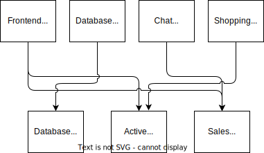
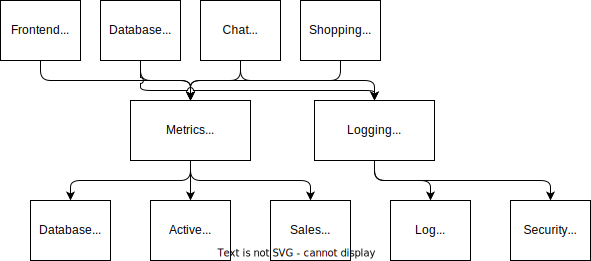

# Apache Kafka

## What is Apache Kafka?

Apache Kafka is an **open-source distributed real-time data/event streaming platform** which allows you to publish, distribute and consume data with high performance, scalability and reliability.

- **Scalable** - Kafka’s partitioned log model allows data to be distributed across multiple servers, making it scalable beyond what would fit on a single server.
- **Fast** - Kafka decouples data streams so there is very low latency, making it extremely fast.
- **Durable** - Partitions are distributed and replicated across many servers, and the data is all written to disk. This helps protect against server failure, making the data very fault-tolerant and durable.

Kafka combines messaging, storage, and stream processing to allow storage and analysis of both historical and real-time data. It provides three main functions to its users:

- Publish and subscribe to streams of records
- Effectively store streams of records in the order in which records were generated
- Process streams of records in real time

*Streaming data is data that is continuously generated by thousands of data sources, which typically send the data records in simultaneously. A streaming platform needs to handle this constant influx of data, and process the data sequentially and incrementally.*

In some ways, Kafka can be thought of as an evolution of traditional message brokers such as Tibco, IBM MQ or RabbitMQ. However, Kafka is much more scalable and performant than previous generations of messaging technology, and has some important architectural evolutions.

### Why would you use Kafka?

Kafka is very widely deployed and is by far the leading platform for data integration in use in industry today. The high throughput and low latency of Apache Kafka have made it one of the leading distributed data-streaming enterprise technologies. It is used by many Fortune 500 companies such as Netflix, Airbnb, Uber, Walmart, and LinkedIn. Kafka is a key enabler for some of the most data-driven and disruptive companies today. Uber, which processes trillions of messages and multiple petabytes of data each day with Kafka, calls it the “cornerstone of our technology stack.” LinkedIn, which created and open-sourced Kafka and still drives much of its development, processes 7 trillion messages per day using Kafka (a 2019 statistic that is no doubt much higher today). Meanwhile, Chinese social media company Tencent (maker of the popular WeChat and QQ instant messaging apps) processes more than 10 trillion messages per day using Kafka.

Since Kafka was open-sourced in 2011, a plethora of alternative event streaming, messaging and pub/sub (publish-subscribe) systems have risen to challenge Kafka: Flink, RabbitMQ, AWS Kinesis, Google Pub/Sub, Azure Event Hub, and others. All claim some combination of easier manageability, lower cost, and/or similar near-real-time performance as Kafka. While some Big Tech companies like Spotify have responded by moving off Kafka, many others like Twitter continue to deploy Kafka or expand their use.

Overall, Kafka remains dominant due to its vaunted reliability, massive scalability, wide compatibility with other data and analytics tools, and flexibility, as it can be run on-premises, hosted in any number of public cloud providers, or as a fully-managed cloud-native service such as Confluent. Nevertheless, Kafka’s reputation as being complicated for companies to set up and manage and challenging to optimize is not undeserved.

### Common Use Cases For Kafka

Though Kafka can be used in many diverse situations, some of the most common use cases include:

- Real Time Streaming e.g. Streaming real time updates from server processes to web or mobile client applications or vice versa;
- SOA or Microservice Integration e.g. Integrating services which need to exchange data or actions, for instance triggering a message to an email service when a customer places an order;
- Data Exchange e.g. Communicating data and events between systems to fullfil some end to end business process, e.g. Distributing the latest prices of stocks on a stock exchange to thousands of mobile application clients in real time;
- ETL - e.g. Taking data from a source to a destination data repository such as from your application into your Data Lake or Data Warehouse;
- Real Time BI & Analytics e.g. Calculating metrics and analytics that allow you to monitor the state of your business in real time.

Data integration scenarios like this occur across all industries. For instance, ecommerce, stock exchanges, IoT and online advertising are all likely to have business requirements in this sphere.

## Evolution

### Publish/Subscribe Messaging

It will starts with simple direct connection, which soon becomes messy to handle and manage:

Then pub/sub helps us manage it better:

But then it slowly starts harder to manage as the business grows because teams building their own pub/sub:

A modern company is an incredibly complex system built out of hundreds or even thousands of custom applications, microservices, databases, SaaS layers, and analytics platforms. And increasingly, the problem we face is how to connect all this up into one company and make it all work together in real time. This problem isn’t about managing data at rest—it is about managing data in motion. And right at the heart of that movement is Apache Kafka, which has become the de facto foundation to any platform for data in motion.

### The Birth of Kafka

The development team at LinkedIn was led by Jay Kreps, a principal software engineer who was previously responsible for the development and open source release of Voldemort, a distributed key-value storage system. The initial team also included Neha Narkhede and, later, Jun Rao. Together, they set out to create a messaging system that could meet the needs of both the monitoring and tracking systems, and scale for the future. The primary goals were to:

- Decouple producers and consumers by using a push-pull model
- Provide persistence for message data within the messaging system to allow multiple consumers
- Optimize for high throughput of messages
- Allow for horizontal scaling of the system to grow as the data streams grew

The result was a publish/subscribe messaging system that had an interface typical of messaging systems but a storage layer more like a log-aggregation system. Combined with the adoption of Apache Avro for message serialization, Kafka was effective for handling both metrics and user-activity tracking at a scale of billions of messages per day.

TIP

> The scalability of Kafka has helped LinkedIn’s usage grow in excess of seven trillion messages produced (as of February 2020) and over five petabytes of data consumed daily.

Kafka was released as an open source project on GitHub in late 2010. As it started to gain attention in the open source community, it was proposed and accepted as an Apache Software Foundation incubator project in July of 2011. Apache Kafka graduated from the incubator in October of 2012. Since then, it has continuously been worked on and has found a robust community of contributors and committers outside of LinkedIn. Kafka is now used in some of the largest data pipelines in the world, including those at Netflix, Uber, and many other companies. Today, over 70% of Fortune 500 companies are using Apache Kafka.

Widespread adoption of Kafka has created a healthy ecosystem around the core project as well. There are active meetup groups in dozens of countries around the world, providing local discussion and support of stream processing. There are also numerous open source projects related to Apache Kafka. LinkedIn continues to maintain several, including Cruise Control, Kafka Monitor, and Burrow.

In the fall of 2014, Jay Kreps, Neha Narkhede, and Jun Rao left LinkedIn to found Confluent, a company centered around providing development, enterprise support, and training for Apache Kafka. They also joined other companies (such as Heroku) in providing cloud services for Kafka. Confluent, through a partnership with Google, provides managed Kafka clusters on Google Cloud Platform, as well as similar services on Amazon Web Services and Azure. One of the other major initiatives of Confluent is to organize the Kafka Summit conference series. Started in 2016, with conferences held annually in the United States and London, Kafka Summit provides a place for the community to come together on a global scale and share knowledge about Apache Kafka and related projects. In addition to its commercial offerings, Confluent has released projects including ksqlDB, a schema registry, and a REST proxy under a community license (which is not strictly open source, as it includes use restrictions).

## How does Kafka work?

Kafka combines two messaging models, queuing and publish-subscribe, to provide the key benefits of each to consumers. Queuing allows for data processing to be distributed across many consumer instances, making it highly scalable. However, traditional queues aren’t multi-subscriber. The publish-subscribe approach is multi-subscriber, but because every message goes to every subscriber it cannot be used to distribute work across multiple worker processes. Kafka uses a partitioned log model to stitch together these two solutions. A log is an ordered sequence of records, and these logs are broken up into segments, or partitions, that correspond to different subscribers. This means that there can be multiple subscribers to the same topic and each is assigned a partition to allow for higher scalability. Finally, Kafka’s model provides replayability, which allows multiple independent applications reading from data streams to work independently at their own rate.

Kafka has many moving parts that depend on data coming into and out of its core to provide value to its users. Producers send data into Kafka, which works as a distributed system for reliability and scale, with logs, which are the basis for storage. Once data is inside the Kafka ecosystem, consumers can help users utilize that data in their other applications and use cases. Our brokers make up the cluster and coordinate with a ZooKeeper cluster to maintain metadata. Because Kafka stores data on disk, the ability to replay data in case of an application failure is also part of Kafka’s feature set. These attributes allow Kafka to become the foundation of powerful stream-processing applications.

## Consumers and Consumer Groups

Suppose you have an application that needs to read messages from a Kafka topic, run some validations against them, and write the results to another data store. In this case, your application will create a consumer object, subscribe to the appropriate topic, and start receiving messages, validating them, and writing the results. This may work well for a while, but what if the rate at which producers write messages to the topic exceeds the rate at which your application can validate them? If you are limited to a single consumer reading and processing the data, your application may fall further and further behind, unable to keep up with the rate of incoming messages. Obviously there is a need to scale consumption from topics. Just like multiple producers can write to the same topic, we need to allow multiple consumers to read from the same topic, splitting the data among them.

Kafka consumers are typically part of a consumer group. When multiple consumers are subscribed to a topic and belong to the same consumer group, each consumer in the group will receive messages from a different subset of the partitions in the topic.

The main way we scale data consumption from a Kafka topic is by adding more consumers to a consumer group. It is common for Kafka consumers to do high-latency operations such as write to a database or a time-consuming computation on the data. In these cases, a single consumer can’t possibly keep up with the rate data flows into a topic, and adding more consumers that share the load by having each consumer own just a subset of the partitions and messages is our main method of scaling. This is a good reason to create topics with a large number of partitions—it allows adding more consumers when the load increases. Keep in mind that there is no point in adding more consumers than you have partitions in a topic—some of the consumers will just be idle.

In addition to adding consumers in order to scale a single application, it is very common to have multiple applications that need to read data from the same topic. In fact, one of the main design goals in Kafka was to make the data produced to Kafka topics available for many use cases throughout the organization. In those cases, we want each application to get all of the messages, rather than just a subset. To make sure an application gets all the messages in a topic, ensure the application has its own consumer group. Unlike many traditional messaging systems, Kafka scales to a large number of consumers and consumer groups without reducing performance.

To summarize, you create a new consumer group for each application that needs all the messages from one or more topics. You add consumers to an existing consumer group to scale the reading and processing of messages from the topics, so each additional consumer in a group will only get a subset of the messages.

## Building Data Pipelines

When people discuss building data pipelines using Apache Kafka, they are usually referring to a couple of use cases. The first is building a data pipeline where Apache Kafka is one of the two end points—for example, getting data from Kafka to S3 or getting data from MongoDB into Kafka. The second use case involves building a pipeline between two different systems but using Kafka as an intermediary. An example of this is getting data from Twitter to Elasticsearch by sending the data first from Twitter to Kafka and then from Kafka to Elasticsearch.

The main value Kafka provides to data pipelines is its ability to serve as a very large, reliable buffer between various stages in the pipeline. This effectively decouples producers and consumers of data within the pipeline and allows use of the same data from the source in multiple target applications and systems, all with different timeliness and availability requirements. This decoupling, combined with reliability, security, and efficiency, makes Kafka a good fit for most data pipelines.

WARNING

> When building an ETL system with Kafka, keep in mind that Kafka allows you to build one-to-many pipelines, where the source data is written to Kafka once and then consumed by multiple applications and written to multiple target systems. Some preprocessing and cleanup is expected, such as standardizing timestamps and data types, adding lineage, and perhaps removing personal information—transformations that will benefit all consumers of the data. But don’t prematurely clean and optimize the data on ingest because it might be needed less refined elsewhere.

## Labs

1. Getting started with Confluent Kafka and Python [[source code](03-processing/kafka/lab-confluent-python/)]
1. Real-time CDC-enabled Extract and Load Pipeline with Kafka on Cloud [[source code](03-processing/kafka/lab-confluent-kafka-faker/)]
1. Real-time fraud detection by applying filter in Kafka topic [[source code](03-processing/kafka/lab-kafka-fraud-detection/)]
1. Kafka Streams for NYC Taxi data [[source code](03-processing/kafka/lab-kafka-nyctaxi/)]
1. Kafka on Cloud with Amazon ECS and Container Orchestration [[source code](03-processing/kafka/lab-kafka-python-ecs/)]
1. Realtime Streaming analytics with Apache Kafka and Spark Streaming [[source code](03-processing/kafka/lab-kafka-spark-streaming/)]
1. Stock Market Kafka Real Time [[source code](03-processing/kafka/lab-kafka-stock-market/)]
1. Data Streaming Pipeline with Kafka for livetolldata [[source code](03-processing/kafka/lab-kafka-toll-analysis/)]
1. Building an event-driven IKEA app with Kafka [[source code](03-processing/kafka/project-ikea/)]

### Getting started with Kafka and CLI

### Getting started with Kafka and Python

### Query Your Data in Kafka Using SQL

Real-time data analytics has grown exponentially, becoming the new normal. Increasingly, more data is now stored or transported via data streaming platforms such as Apache Kafka, Apache Pulsar, or Amazon Kinesis. In a traditional data stack, streaming data gets imported into a database or data warehouse for users to further analyze or process. However, it is actually possible to run SQL directly on streaming data.

## Explore Further

1. Watch these videos to explore further: [YouTube1](https://www.youtube.com/watch?v=FKgi3n-FyNU), [YouTube2](https://www.youtube.com/watch?v=PzPXRmVHMxI), [YouTube3](https://www.youtube.com/watch?v=hyJZP-rgooc), [YouTube4](https://www.youtube.com/watch?v=j-Fa4in_dxc)
1. Follow [this](https://www.acceldata.io/blog/data-engineering-optimize-apache-kafka) blog post for more information.
1. [Kafka: The Definitive Guide, 2nd Edition](https://learning.oreilly.com/library/view/kafka-the-definitive/9781492043072/)
1. [Streaming data pipelines @ Slack](https://speakerdeck.com/vananth22/streaming-data-pipelines-at-slack)
1. [Samza at Streaming Data Pipelines @ Slack](https://youtu.be/wbS1P9ehgd0)
1. [Building Scalable Real Time Event Processing with Kafka and Flink at Doordash](https://doordash.engineering/2022/08/02/building-scalable-real-time-event-processing-with-kafka-and-flink/)
1. [Creating Adobe Experience Platform Pipeline with Kafka](https://business.adobe.com/blog/the-latest/creating-adobe-experience-platform-pipeline-with-kafka)
1. [Debezium to Snowflake: Lessons learned building data replication in production using Kafka](https://medium.com/shippeo-tech-blog/debezium-to-snowflake-lessons-learned-building-data-replication-in-production-a5430a9fe85b)
1. [Data streaming with Apache Kafka - guide for data engineers](https://www.mikulskibartosz.name/data-streaming-with-Apache-Kafka/)
