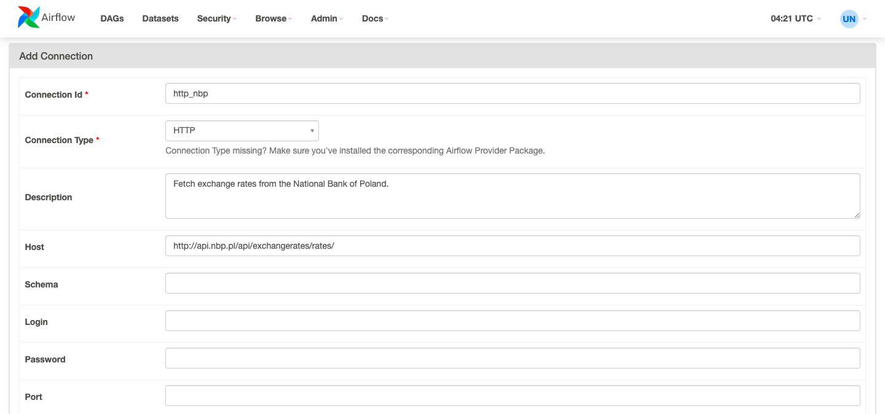

# Airflow Forex ETL

The ETL process will extract data from fixer.io API, transform it, and load it to a PostgreSQL database. This project aims to have an automated process that constantly feeds the PostgreSQL database with data.

Process steps:

1. Create a free accout on fixer.io
2. Get the API key and add in the DAG
3. Add connection: {'connection_id':'is_api_available', 'connection_type':'http', 'host':'https://api.apilayer.com/fixer'}
4. Add connection: {'connection_id':'postgres', 'connection_type':'postgres', 'host':{HOST}, 'port':{PORT}, 'schema':{DATABASE}, 'login':{USER}, 'password':{PASSWORD}}
5. Run the DAG

## ETL for Exchange Rates from the National Bank of Poland

We will first get the data from HTTP API. e.g. Here you will find the latest exchange rate - http://api.nbp.pl/api/exchangerates/rates/a/eur.

## Step 1 - Setup the HTTP connection in Airflow

Go to `Airflow UI > Admin > Connections` and create a new connection. Then enter the details as following:

| Parameter       | Value                                                 |
| --------------- | ----------------------------------------------------- |
| Connection Id   | http_nbp                                              |
| Connection Type | HTTP                                                  |
| Description     | Fetch exchange rates from the National Bank of Poland |
| Host            | http://api.nbp.pl/api/exchangerates/rates             |

