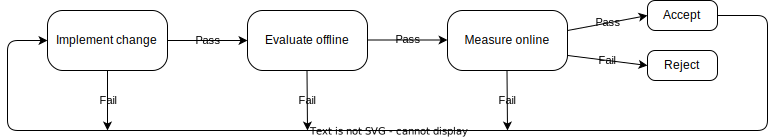

# Experimentation

## Common Engineering Workflow

(1) A new idea is first implemented as a code change to the system. (2) Typically, some offline evaluation is performed that rejects ideas that are expected to negatively impact business metrics. (3) The change is pushed into the production system, and business metrics are measured there, online. Accepted changes become permanent parts of the system. The whole workflow repeats, creating reliable, continuous improvement of the system.

## Examples of Engineering Workflow

### Machine learning engineer’s workflow

Imagine an MLE who works on a web-based news site. Their workflow might look like below:

The site contains an ML component that predicts clicks on news articles. (1) The MLE fits a new predictor. (2) An estimate of ad revenue from the new predictor is made using logs of user clicks and ad rates. (3) The new predictor is deployed to production and actual ad revenue is measured. If it improves ad revenue, then it is accepted into the system.

The key machine learning (ML) component of the website is a predictor model that predicts which news articles a user will click on. The predictor might take as input many *features*, such as information about the user's demographics, the user's previous activity on the website, and information about the news article's title or its content. The predictor's output will be an estimate of the probability that a specific user will click on a given news article. The website could use those predictions to rank and sort news articles on a headlines-summary page hoping to put more appealing news higher up on the page.

### Quantitative trader’s workflow

A quant’s workflow is very similar to the MLE’s workflow. Only the details change. There’s a different prediction to be made, for example. See this figure:

The strategy contains a price-change predictor. (1) The quant produces a new predictor. (2) Profit and risk estimates come from a simulation using historical market data. (3) Live trading measures the true profit and risk. If the new predictor increases profit and/or reduces risk, then it is accepted into the system.

This quant is building an automated trading strategy. It is a piece of software that issues BUY and SELL orders to an exchange hoping to, as they say, buy low and sell high. A key component is a model that predicts change in the price of the financial instrument (e.g., a stock) being traded. If the price is predicted to increase, it's a good time to issue a BUY order. Similarly, if the price is predicted to decrease, it's a good time to SELL. The business metric for this system is profit. But it's also risk. Quants want both higher profit *and* lower risk. It is not uncommon (in practice, it's the norm) to be concerned with more than one business metric when optimizing a system.

### Software engineer’s workflow

SWEs work on a broad range of systems. In this text, we'll define SWE problems as those that do not involve building models from data (thus differentiating them from MLEs and quants). SWEs build compilers, caching systems, web servers, trading system infrastructure (on which trading strategies run), and much more.

As an example, let's consider the problem of improving the response time of a search engine with the goal of lowering the "bounce rate," which is the probability that a user will navigate away from a website after seeing just one page. Figure below shows the SWE's workflow:

The server queries, aggregates, and transforms relevant data before sending the user a response. (1) The SWE changes the transformation portion of the code. (2) They time the code offline, verifying that it takes less time than the old code to transform several test data sets. (3) Running in production, the SWE measures whether the use of this new code results in a lower bounce rate, the business-relevant metric. If so, the new code is accepted as a permanent part of the system.

This SWE has built a search engine. It is a web server that responds to a user's request by querying internal sources for a data set, transforming that data set, and delivering a formatted response to the user. Users are very sensitive to the time it takes for a web server to respond. If it takes too long, a user may navigate away from the web page before the response is delivered.
