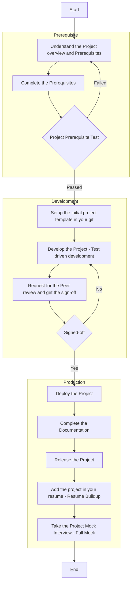

# Bootcamp Instructions

## Training methods

1. Agile: You will design your own learning modules and I will be your scrum master, guiding you in your learning path.
2. Monologue: I will be showing you the process on my screen and you will be asking questions/doubts.
3. Interactive: You will be doing the hands-on on your system and I will be guiding you step by step.

## Assignments

- In assignments, you’re given a scenario and a set of tasks. Instead of following step-by-step instructions, you will use the skills learned from the classes to figure out how to complete the tasks on your own!
- When you take an assignment, you will not be taught new concepts. You are expected to extend your learned skills, like changing default values and reading and researching error messages to fix your own mistakes.
- To score 100% you must successfully complete all tasks within the time period!

## Project Process

## Techstack

## Lab/Assignment Submission Instructions

### Cassandra NoSQL Data Modeling

1. Understand the Requirements
2. Understand the Data
3. Analyze the Query Patterns
4. Design the Cassandra NoSQL Data Model in NoSQL Workbench
5. Load the Data Model in Amazon Keyspaces
6. Verify the Data Model via Amazon Console
7. Write DML in Python to ingest the Data into the Data Model
8. Save all the assets (code/images/screenshots/links) into a folder of your name under `assignments > data-modeling-cassandra`.
9. Create the GitHub Pull Request (PR) and add the instructor as the code reviewer.
10. Notify the Instructor and wait for the feedback.

**Scoring Factors**

|                        | Weightage |
| ---------------------- | --------- |
| Requirement Analysis   | 5         |
| Data Analysis          | 5         |
| Query Pattern Analysis | 10        |
| Data Model Design      | 40        |
| Data Model Load        | 10        |
| Data Ingestion (DML)   | 20        |
| PR Submission          | 10        |

All the above factors will be assessed during a Mock Interview and Viva. Once you create the PR, notify the instructor and a 15-min slot will be allotted for the viva.

## Difficulty Criteria

★☆☆ - Easy

★★☆ - Medium

★★★ - Hard
