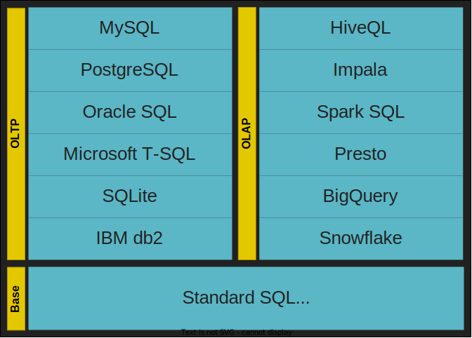

# SQL Basics

## What is SQL?

**Structured Query Language** (**SQL**) is the most widely used language in relational database platforms for recording, editing, re-editing, and querying operations. It is a must-have skill for data engineers. They use the querying language to perform essential tasks like modeling data, extracting performance metrics, and developing reusable data structures.

Data engineers need to be proficient not just in querying data and pulling metrics, but also in data structures, manipulation and security within SQL. Broadly, a data engineer may face SQL questions in these categories:

- SQL queries - Using SQL data query language (DQL) statements to pull metrics and analyze data. Commands to know: SELECT
- Data modeling - Using DDL commands to create database schema and define data structures. Commands to know: CREATE, ALTER, DROP, RENAME, TRUNCATE, COMMENT
- Data manipulation - Using DML statements to retrieve and manipulate data. Commands to know: INSERT, UPDATE, DELETE, MERGE, CALL, EXPLAIN PLAN, LOCK TABLE
- Data security - Using DCL (data control language) commands to manage database security. Commands to know: GRANT, REVOKE

> https://www.youtube.com/embed/AK7_m-aThfw

1. **Data definition:** The ability to create and modify the structure of a database, including creating tables, defining columns and data types, and setting constraints.
2. **Data manipulation:** The ability to add, update, and delete data within a database, as well as retrieve specific data using SELECT statements.
3. **Data integrity:** Ensuring that the data within a database is accurate, consistent, and free of errors, through the use of constraints, keys, and indexes.
4. **Data querying:** Retrieving specific data from a database using SELECT statements, filtering and sorting the data, and joining tables to combine data from multiple sources.
5. **Data modeling:** The ability to represent real-world entities and relationships in a database through the use of tables, columns, and keys.*
6. **Data normalization:** The process of organizing data in a database to minimize data redundancy and improve data integrity.*
7. **Data security:** Techniques for protecting a database from unauthorized access, such as through the use of user accounts, passwords, and access controls.
8. **Data maintenance:** The ability to backup, restore, and optimize a database to ensure its ongoing performance and stability.*

## Advantages

The list of advantages is very long, but the main points are as follows:

- **Standardization**: As mentioned, SQL has been standardized by *ANSI* and is still used in many database systems. This is why SQL is one of the most documented languages today, easier to learn, and useful for day-to-day activities.
- **Simplicity with scalability**: SQL is an easy-to-understand language with simple syntax fundamentals, answering high-scalability database scenarios by processing millions of pieces of data.
- **Portability**: Because it is standard in several *DBMSs*, SQL is portable between these different types of database managers, even though there are some particularities in the SQL of each.
- **Multiple data views**: With SQL, it is possible to define different views of the database structure for different user needs. For example, you might have users who are only allowed to explore the data and perform **SELECT** commands, whereas other users can add columns in tables but cannot delete any columns. This granularity of permissions makes databases more fully configurable.

## Disadvantages

Of course, we can find more disadvantages when we know about NoSQL databases, but the disadvantages most encountered by data architects to justify an analysis of other databases are these:

- **Database processing cost**: In general, the cost of processing a database that uses the SQL language is high compared to more modern database languages. This means that the database needs a robust infrastructure for data processing. Compared to a NoSQL database, a SQL database uses compute power, RAM, and storage speed more intensively.
- **Pre-build and fixed schema**: A SQL database must be planned and implemented (the creation of tables, columns, relationships, and so on) before implementing the software. Your schema should be created and, once created, only changed upon a general impact analysis of the database.

## Flavors of SQL

What is the extent of your knowledge of SQL? Basic, intermediate or advanced?

- Basic: simple select queries with filtering, inner and left joins, aggregation, confident use of date functions, CASE statement, UNIONs etc., then state that you can create SQL queries to a basic level.
- Intermediate: CTEs and temp tables, window functions, string handling functions (like REPLACE, SUBSTRING, LEFT, RIGHT, CHARINDEX), do numeric calculations, handle NULLs (with ISNULL, COALESCE and NULLIF), CAST and CONVERT data types, use derived tables and subqueries, then make it clear that you have intermediate SQL skills.
- If you can handle all the above plus strong data manipulation knowledge including PIVOT, recursion, use correlated subqueries, build ETL processes in code, create stored procs, functions and views, indexing, loops, dynamic SQL and have a good understanding of collation and optimisation, then let them know that you have advanced SQL knowledge and skills.

## SQL commands categories

To understand the structure of SQL, it is subdivided into five categories of commands:

- **Data Query Language** (**DQL**): Defines the command used so that we can query (**SELECT**) the data stored in the database
- **Data Manipulation Language** (**DML**): Defines the commands used for manipulating data in the database (**INSERT**, **UPDATE**, and **DELETE**)
- **Data Definition Language** (**DDL**): Defines the commands used for creating tables, views, and indexes, updating these structures (**ALTER**), as well as removal (**DROP**)
- **Data Control Language** (**DCL**): Defines the commands used to control access to database data by adding (**GRANT**) and removing (**REVOKE**) access permissions
- **Data Transaction Language** (**DTL**): Defines the commands used to manage transactions executed in the database, such as starting a transaction (**BEGIN**), confirming it (**COMMIT**), or undoing it (**ROLLBACK**)

The following diagram demonstrates the categories of the SQL language and their main commands for quick reference:

These five categories contain all the necessary syntaxes of SQL commands for operations in a database.

SQL was initially created to be the language for generating, manipulating, and retrieving data from relational databases, which have been around for more than 40 years. Over the past decade or so, however, other data platforms such as Hadoop, Spark, and NoSQL have gained a great deal of traction, eating away at the relational database market. However, the SQL language has been evolving to facilitate the retrieval of data from various platforms, regardless of whether the data is stored in tables, documents, or flat files.

Whether you will be using a relational database or not, if you are working in data engineering, business intelligence, or some other facet of data analysis, you will likely need to know SQL, along with other languages/platforms such as Python and R. Data is everywhere, in huge quantities, and arriving at a rapid pace, and people who can extract meaningful information from all this data are in big demand.

## Key Commands

Important Commands that you must know:

- CREATE - To create table or view or database
- SELECT - To select the data values from the table in a database
- FROM - To specify table name from where we are retrieving the records
- WHERE - To filter the results based on the condition specified in the where clause
- LIMIT - To limit the number of rows returned as the result
- DROP - To delete the table or database
- UPDATE - To update the data in the table
- DELETE - To delete the rows in the table
- ALTER TABLE - To add or remove columns from the table
- AS - To rename column with an alias name
- JOIN - To combine the rows of 2 or more tables
- AND - To combine rows in which records from both/more table are evaluated using And condition
- OR - To combine rows in which records from both/more table are evaluated using Or condition
- IN - To specify multiple values using the where clause/condition
- LIKE - To search/identify the patterns in the column
- IS NULL - To check and return those rows that contains NULL values
- CASE - To return values after evaluating the specified condition
- GROUP BY - To group rows which consist of same values into the summary rows/columns
- ORDER BY - To specify the order of the result returned ( ASC or DESC)
- HAVING - To specify conditions for aggregate functions
- COUNT - To count the number of rows
- SUM - To return sum of the column
- AVG - To return average of the column
- MIN - To return min value in the column
- MAX - To return max value in the column

## Key Functions

* **Aggregate functions:** These functions are used to summarize data, such as counting the number of rows, calculating the sum or average of a column, or finding the minimum or maximum value. Examples include COUNT(), SUM(), AVG(), MIN(), and MAX().
* **Window functions:** These functions are used to perform calculations across rows within a specific window or frame of a query result set. Examples include ROW_NUMBER(), RANK(), DENSE_RANK() and NTILE().
* **String functions:** These functions are used to manipulate and extract information from strings. Examples include SUBSTRING(), LENGTH(), CONCAT(), UPPER(), and LOWER().
* **Date and time functions:** These functions are used to work with date and time data. Examples include CURRENT_DATE(), CURRENT_TIME(), CURRENT_TIMESTAMP(), and EXTRACT().
* **Conversion functions:** These functions are used to convert data from one type to another. Examples include CAST() and CONVERT().
* **Conditional functions:** These functions are used to perform conditional calculations. Examples include CASE(), COALESCE() and NULLIF().
* **Analytic functions:** These functions are used to perform complex calculations over a group of rows. Examples include RANK(), DENSE_RANK(), ROW_NUMBER(), and LEAD() and LAG().