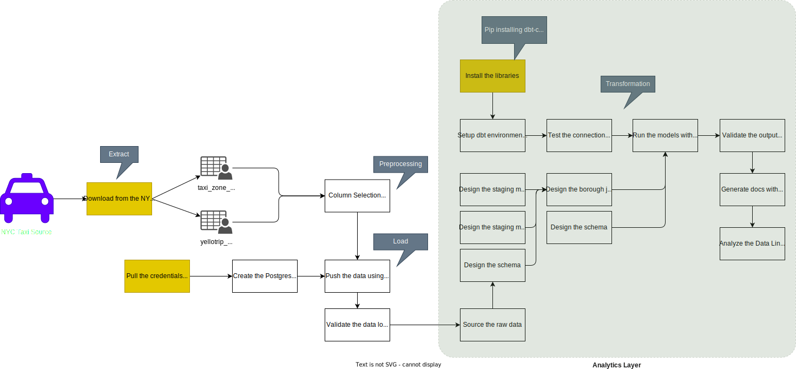

# Lab: Building an ELT pipeline for a cab service company using dbt and Postgres

## Architecture



## Files

[](https://github.com/sparsh-ai/recohut/tree/main/docs/03-processing/lab-dbt-nyctaxi)

```
├── [ 14K]  01-sa-dbt.ipynb
├── [ 515]  README.md
├── [ 302]  data
│   └── [ 206]  download.sh
├── [1.3K]  dbt_project.yml
├── [ 55K]  flow.drawio.svg
├── [ 46K]  main-2.ipynb
├── [ 52K]  main-with-great-expectations.ipynb
├── [ 85K]  main.ipynb
├── [4.9K]  models
│   ├── [1.2K]  example
│   │   ├── [ 475]  my_first_dbt_model.sql
│   │   ├── [ 115]  my_second_dbt_model.sql
│   │   └── [ 437]  schema.yml
│   ├── [1.2K]  marketing
│   │   ├── [  96]  marketing_trips_vendor_model.sql
│   │   ├── [ 422]  marketing_trips_with_borough_name_model.sql
│   │   └── [ 525]  schema.yml
│   ├── [ 363]  schema.yml
│   ├── [1.6K]  staging
│   │   ├── [1.1K]  schema.yml
│   │   ├── [ 112]  taxi_zone_lookup_model.sql
│   │   └── [ 205]  yellow_taxi_trips_models.sql
│   └── [ 405]  trips_with_borough_name_model.sql
└── [  92]  requirements.txt

 260K used in 5 directories, 20 files
```

## Notebooks

[](https://nbviewer.org/github/sparsh-ai/recohut/blob/main/docs/03-processing/lab-dbt-nyctaxi)
