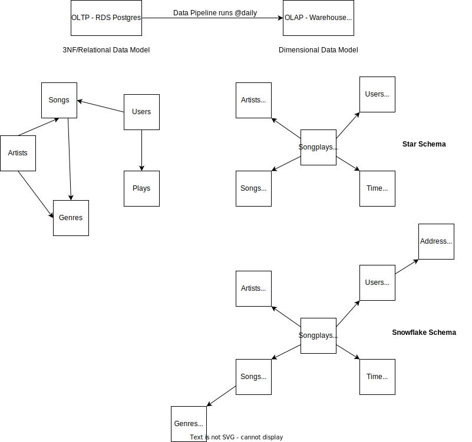

# Sparkify Music Company Data Model in Postgres

In this, we will model the data with Postgres and build an ETL pipeline using Python. The fact and dimension tables for a star database schema for a particular analytic focus is defined, and an ETL pipeline that transfers data from files in two local directories into these tables in Postgres using Python and SQL was developed.

A startup called Sparkify wants to analyze the data they've been collecting on songs and user activity on their new music streaming application. The analytics team is particularly interested in understanding what songs users are listening to. Currently, they don't have an easy way to query their data, which resides in a directory of JSON logs on user activity on the application, as well as a directory with JSON meta-data on the songs in their application.

They'd like a data engineer to create a Postgres database with tables designed to optimize queries on song play analysis. The role of this project is to create a database schema and ETL pipeline for this analysis.

We will model the data with Postgres and build an ETL pipeline using Python. The fact and dimension tables for a star database schema for a particular analytic focus is defined, and an ETL pipeline that transfers data from files in two local directories into these tables in Postgres using Python and SQL was developed.

## Songs dataset

Songs dataset is a subset of [Million Song Dataset](http://millionsongdataset.com/). Each file in the dataset is in JSON format and contains meta-data about a song and the artist of that song.

Sample record:

```json
{"num_songs": 1, "artist_id": "ARJIE2Y1187B994AB7", "artist_latitude": null, "artist_longitude": null, "artist_location": "", "artist_name": "Line Renaud", "song_id": "SOUPIRU12A6D4FA1E1", "title": "Der Kleine Dompfaff", "duration": 152.92036, "year": 0}
```

## Logs dataset

Logs dataset is generated by [Event Simulator](https://github.com/Interana/eventsim). These log files in JSON format simulate activity logs from a music streaming application based on specified configurations.

Sample record:

```json
{"artist": null, "auth": "Logged In", "firstName": "Walter", "gender": "M", "itemInSession": 0, "lastName": "Frye", "length": null, "level": "free", "location": "San Francisco-Oakland-Hayward, CA", "method": "GET","page": "Home", "registration": 1540919166796.0, "sessionId": 38, "song": null, "status": 200, "ts": 1541105830796, "userAgent": "\"Mozilla\/5.0 (Macintosh; Intel Mac OS X 10_9_4) AppleWebKit\/537.36 (KHTML, like Gecko) Chrome\/36.0.1985.143 Safari\/537.36\"", "userId": "39"}
```

## Quality

1. LogDataset : userID - Found users with empty string '', firstName as None
2. LogDataset : Major of the artist_id & song_id is null
3. Artists table doesn't have list of all the artists found in log
4. Songs table doesn't have all the songs found in log
5. LogDataset : Logs are ordered by timestamp, so they need to be sorted. This enables latest user level to be updated in the users table

## Tidiness

1. LogDataset : ts : timestamp column as int64 needs to converted to timestamp
2. SongPlays table : Add new column songplay_id as serial ( auto-increment )
3. user : table : Adding column ts
4. songplays : table : Adding columns itemInSession, song, artist

## Database Schema Design - Entity Relation Diagram (ERD)

The Star Database Schema used for data modeling in this ETL pipeline. There is one fact table containing all the metrics (facts) associated to each event (user actions), and four dimensions tables, containing associated information such as user name, artist name, song meta-data etc. This model enables to search the database schema with the minimum number of *SQL JOIN*s possible and enable fast read queries. The amount of data we need to analyze is not big enough to require big data solutions or NoSQL databases.


## 3NF to Dimensional Data Model



## Process Flow

