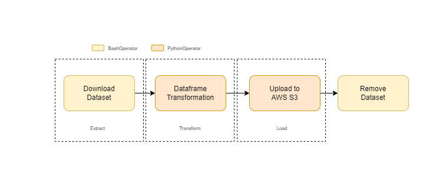
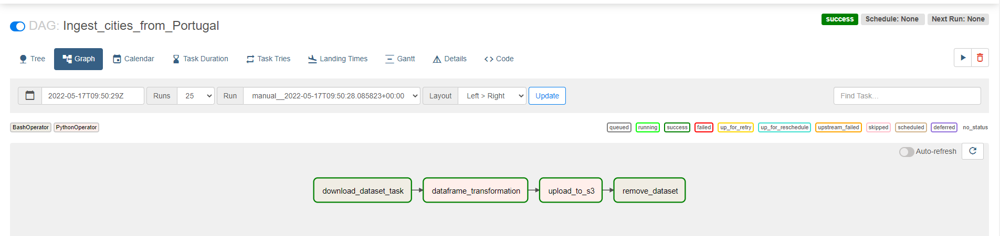

# OLX Data Engineering Challenge

## Tasks

1. Filter only Portuguese cities
2. Add a new column with corresponding [GeoHash](https://en.wikipedia.org/wiki/Geohash) codes using the set of longitude and latitude coordinates.
3. Write out the final dataset into AWS S3 Bucket.

The solution must be coded in Python and you can use any public domain libraries. It should work with any file respecting the same schema as the one provided.

You should provide the data on AWS S3 with the structure of the example, ie:

```json
[{
"city": "Lisbon",
"lat": 38.708,
"lng": -9.139,
"population": 506654, "geohash": "eycs0n94my5w"},
{"city": "Sintra",
"lat": 38.7974,
"lng": -9.3904, "population": 377835, "geohash": "eyckdqf55zd3"},
{"city": "Vila Nova de Gaia", "lat": 41.1333,
"lng": -8.6167, "population": 302295, "geohash": "ez3f5bjdb6fu"},
{"city": "Porto",
"lat": 41.1495,
"lng": -8.6108, "population": 237591, "geohash": "ez3fh51c1yf0"
}]
```

## What do we expect from you?

- Proper documentation
- Setup/Launch instructions if required
- Good software design
- Proper use of data structures
- Compliance with Python standards and modern usages (eg.: [PEP8](https://www.python.org/dev/peps/pep-0008/))

## Workflow



## Airflow Pipeline


